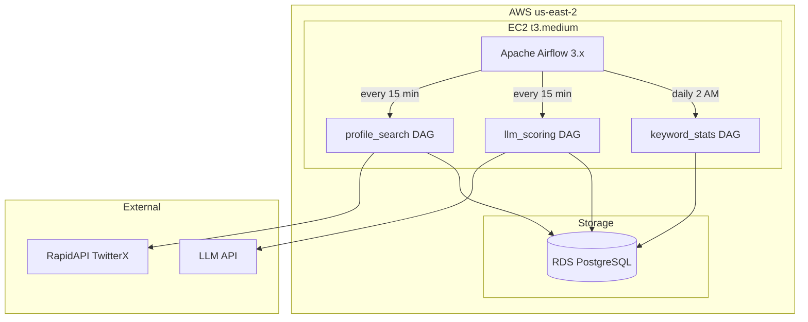
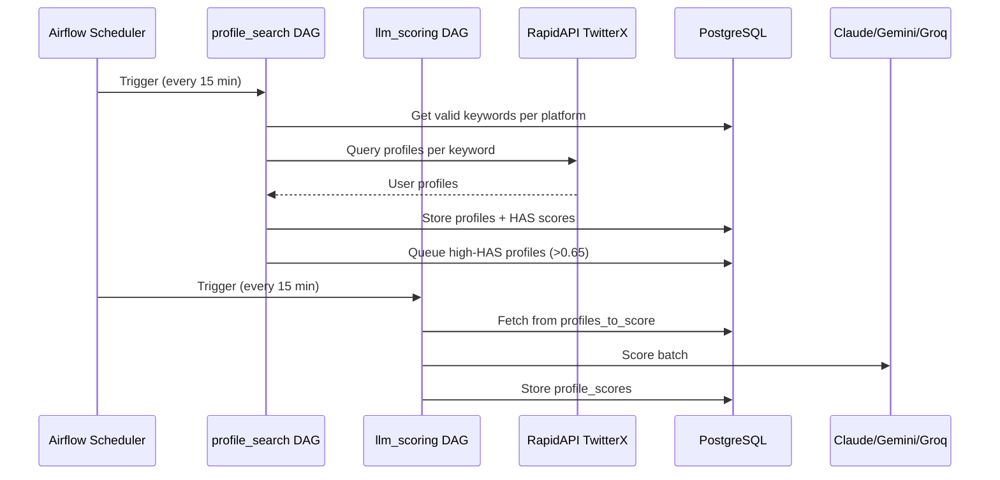
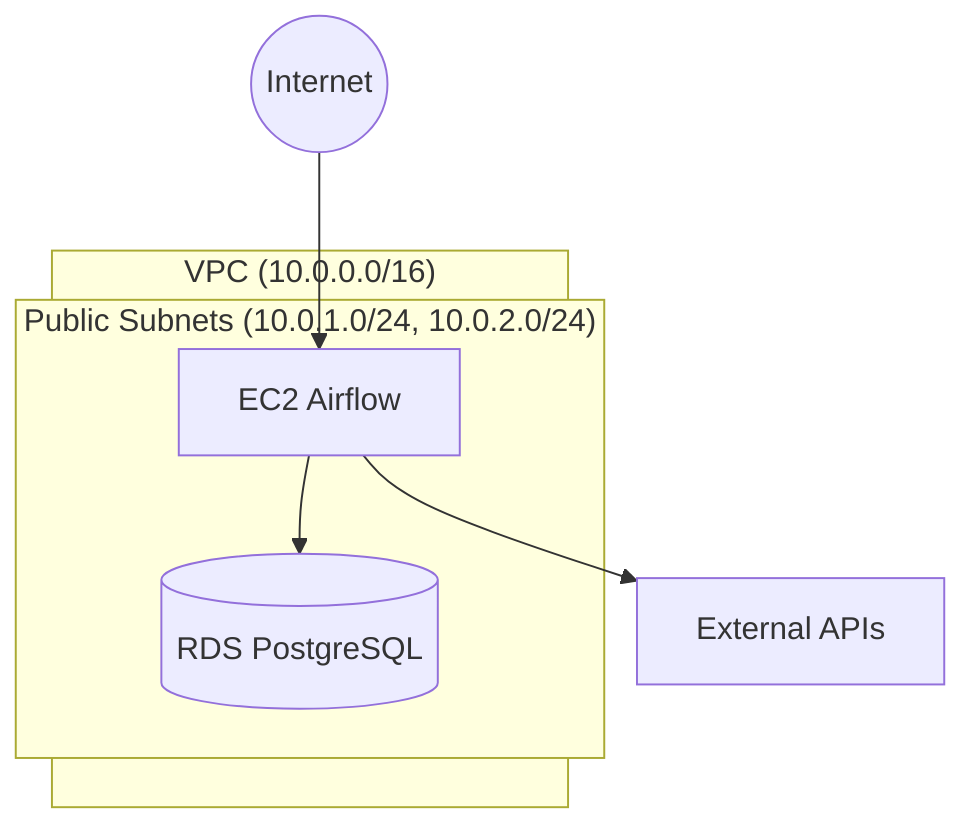

# System Architecture

## Overview

Profile Scorer uses Apache Airflow on EC2 to orchestrate a multi-platform social media profile search and scoring pipeline.



**Airflow URL:** https://profile-scorer.admin.ateliertech.xyz

**Resource Group:** [`profile-scorer-saas`](https://console.aws.amazon.com/resource-groups) - View all resources in AWS Console

**Tags:** All resources are tagged with:

- `Project: profile-scorer-saas`
- `Environment: mvp`
- `ManagedBy: pulumi`

## Data Flow



## Airflow DAGs

**Location:** `airflow/dags/`

The Airflow implementation uses Python with `@task.virtualenv` for SQLAlchemy 2.0+ isolation from Airflow's environment.

### profile_search DAG

**Schedule:** Every 15 minutes

Multi-platform profile search with dynamic task expansion:

```
platforms() → ['twitter', 'bluesky']
    ↓
keyword_engine.expand(platform) → [configs_twitter, configs_bluesky]
    ↓
flatten_keywords() → [all_keyword_configs]
    ↓
query_profiles.expand(keyword_config) → uses search_profiles router
    ↓
collect_results() → update_db() → summarize()
```

Tasks:
1. `platforms` - Returns list of all platforms from `Platform` enum
2. `keyword_engine` (expanded per platform) - Gets valid keywords that have `still_valid=True` and are not exhausted
3. `flatten_keywords` - Combines keyword configs from all platforms into single list
4. `query_profiles` (expanded per keyword) - Uses `search_profiles` router to query the appropriate API
5. `collect_results` - Bridge task to materialize lazy proxy for virtualenv
6. `update_db` - Processes results with per-platform statistics
7. `summarize` - Logs per-platform and total summaries

### llm_scoring DAG

**Schedule:** Every 15 minutes

Probability-based LLM scoring:
1. `get_profiles_to_score` - Fetches from `profiles_to_score` queue
2. `score_with_model` (expanded per model) - Invokes LLM with probability-based selection
3. `summarize` - Logs scoring results

### keyword_stats DAG

**Schedule:** Daily at 2 AM

Tasks:
1. `get_all_keywords` - Get distinct keywords from `api_search_usage`
2. `calculate_keyword_stats` - Aggregate profiles, HAS scores, label rates per platform
3. `upsert_keyword_stats` - Update `keyword_stats` and `keyword_status` tables

## Airflow Packages

**Location:** `airflow/packages/`

| Package           | Description                                           |
| ----------------- | ----------------------------------------------------- |
| `db`              | SQLModel models, session management                   |
| `search_profiles` | Multi-platform search router (Twitter, Bluesky, etc.) |
| `scoring`         | HAS algorithm + LangChain multi-provider LLM scoring  |
| `utils`           | Logging, settings, base models                        |

### search_profiles Router

The `search_profiles` package provides a unified interface for multi-platform search:

```python
from search_profiles import search_profiles, Platform, SearchResult

# High-level API
result = search_profiles(Platform.TWITTER, "data scientist")
for user in result.users:
    print(user["screen_name"])

# Result includes normalized fields across platforms
result.platform      # 'twitter'
result.users         # List of normalized user dicts with platform_id
result.next_cursor   # Pagination cursor
result.success       # True if no error
```

The router normalizes user data to common fields:
- `platform_id` (replaces `rest_id` for Twitter, `did` for Bluesky)
- `screen_name`, `name`, `description`
- `followers_count`, `friends_count`, `statuses_count`

## Network Architecture



| Subnet Type | CIDR          | Internet Access | Purpose                |
| ----------- | ------------- | --------------- | ---------------------- |
| Public      | 10.0.1-2.0/24 | Direct (IGW)    | EC2 Airflow, RDS (dev) |

**Note:** RDS is in public subnets for dev access. Move to private subnets for production.

**Cost Optimization:** NAT Gateway was removed (saves ~$32/month). EC2 in public subnet accesses internet directly.

## LLM Scoring System

The Airflow DAGs support multiple LLM models with probability-based invocation.

| Alias              | Full Name                                    | Probability | Batch Size |
| ------------------ | -------------------------------------------- | ----------- | ---------- |
| `meta-maverick-17b`  | `meta-llama/llama-4-maverick-17b-128e-instruct` | 0.7 (70%)   | 25         |
| `claude-haiku-4.5`   | `claude-haiku-4-5-20251001`                    | 0.6 (60%)   | 25         |
| `gemini-flash-2.0`   | `gemini-2.0-flash`                             | 0.4 (40%)   | 15         |

**Scoring Flow:**
1. Profiles serialized in TOON format
2. Sent to LLM with audience config
3. Output: JSON array validated with Zod schema `{ handle, label, reason }[]`
4. Trivalent labeling: `true` (match), `false` (no match), `null` (uncertain)

## Rate Limiting

### RapidAPI TwitterX

- **Limit:** 10 req/s, 500K req/month
- **Strategy:** Airflow dynamic task mapping controls concurrency

### LLM APIs

- **Claude Haiku:** $0.25/1M input, $1.25/1M output
- **Gemini Flash:** Free tier
- **Groq (Llama):** Free tier with rate limits
- **Batch size:** 25 profiles per request

## Monitoring & Observability

### CloudWatch Dashboard

**Link:** [profile-scorer](https://us-east-2.console.aws.amazon.com/cloudwatch/home?region=us-east-2#dashboards:name=profile-scorer)

The dashboard provides a unified view of all system components:

| Row                 | Metrics                                      |
| ------------------- | -------------------------------------------- |
| **EC2 Health**      | CPU utilization, network I/O, status checks  |
| **Database Health** | RDS connections, CPU utilization, free storage |
| **Database I/O**    | Read/write IOPS, read/write latency          |

### Cost Management

| Resource              | Link                                                                                                                  |
| --------------------- | --------------------------------------------------------------------------------------------------------------------- |
| **AWS Budget**        | [profile-scorer-monthly](https://us-east-1.console.aws.amazon.com/billing/home#/budgets) - $50/month limit            |
| **Cost Explorer**     | [By Service](https://us-east-1.console.aws.amazon.com/cost-management/home#/cost-explorer)                            |
| **Anomaly Detection** | [Default-Services-Monitor](https://us-east-1.console.aws.amazon.com/cost-management/home#/anomaly-detection/monitors) |

**Current Cost Breakdown (December 2025):**

| Service    | Cost    | Notes                                                    |
| ---------- | ------- | -------------------------------------------------------- |
| EC2        | ~$30.00 | t3.medium (4GB RAM - required for PyTorch/transformers)  |
| RDS        | ~$13.00 | PostgreSQL db.t4g.micro                                  |
| CloudWatch | ~$0.30  | Basic metrics + status check alarm                       |
| **Total**  | **~$43** | Monthly estimate                                        |

> **Note:** EC2 was upgraded from t3.small (2GB) to t3.medium (4GB) in Dec 2025
> to prevent OOM during DAG execution with sentence-transformers/PyTorch.
> A CloudWatch auto-recovery alarm was added to automatically recover the instance
> if system status checks fail.

**To enable tag-based filtering:**

1. AWS Console → Billing → Cost allocation tags
2. Activate `Project` tag
3. Wait 24 hours

## Pulumi Stack Outputs

```bash
cd infra

# Database
uv run pulumi stack output db_connection_string --show-secrets

# EC2 Airflow
uv run pulumi stack output airflow_public_ip
uv run pulumi stack output airflow_ssh_command
uv run pulumi stack output airflow_url

# Monitoring
uv run pulumi stack output dashboard_url
uv run pulumi stack output budget_name

# Resource Group
uv run pulumi stack output resource_group_arn
```

## Deployment

### Airflow Code Changes (Frequent)

Push to the `profile-scorer.airflow` repository triggers GitHub Actions:

```bash
cd airflow
git add . && git commit -m "Update DAG"
git push origin main  # Triggers deploy.yml workflow
```

The workflow:
1. rsync files to EC2
2. Rebuilds Docker images
3. Restarts Airflow containers
4. Reserializes DAGs

### Infrastructure Changes (Rare)

Push to `infra/**` in parent repo triggers Pulumi deployment:

```bash
cd infra
uv run pulumi up --yes
```

If EC2 is recreated, run the bootstrap script:

```bash
./deploy.sh <new-ip> airflow
```

## SSH Access

```bash
# Get SSH command from Pulumi
cd infra && uv run pulumi stack output airflow_ssh_command

# Or manually
ssh -i ~/.ssh/airflow.pem ec2-user@<ip>

# View logs
cd /opt/airflow && docker-compose logs -f airflow-scheduler
```
