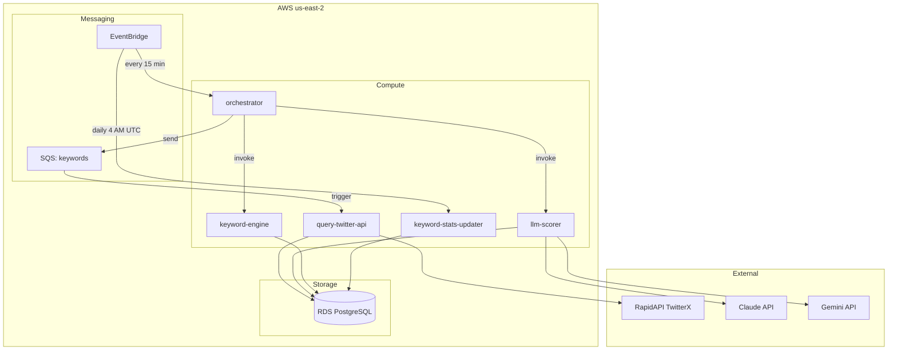
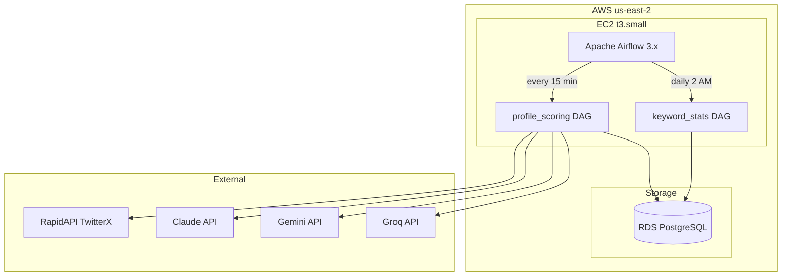
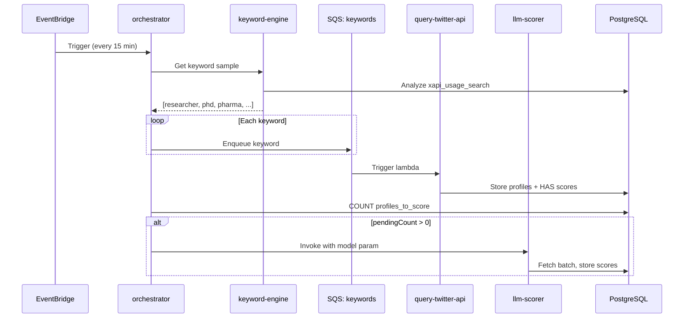
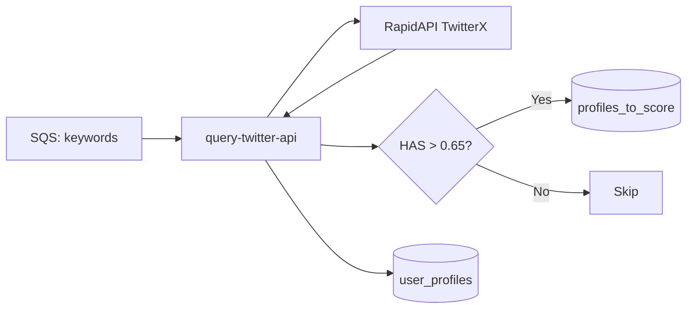
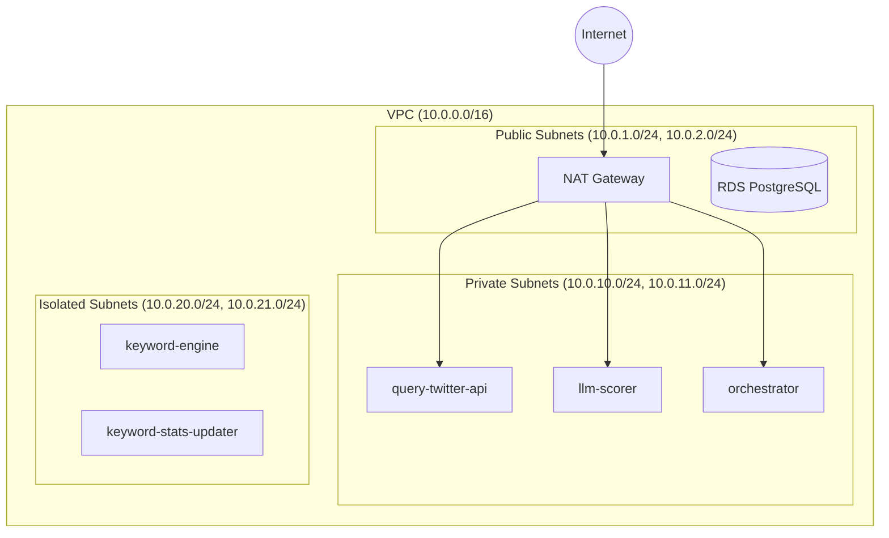
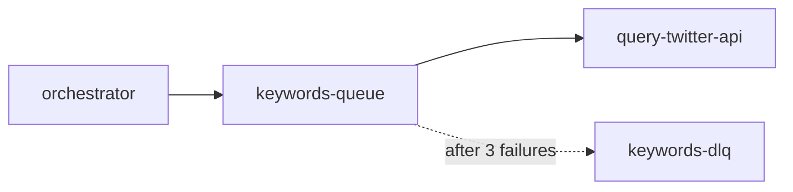

# System Architecture

## Overview

The system supports two deployment modes during the Lambda → Airflow migration:

### Current: Lambda Pipeline (Legacy)



### Migration Target: Airflow Pipeline



**Airflow URL:** https://profile-scorer.admin.ateliertech.xyz

**Resource Group:** [`profile-scorer-saas`](https://console.aws.amazon.com/resource-groups) - View all resources in AWS Console

**Tags:** All resources are tagged with:

- `Project: profile-scorer-saas`
- `Environment: mvp`
- `ManagedBy: pulumi`

## Data Flow



## Lambda Functions

| Lambda                | Memory | Timeout | Subnet   | Trigger                      |
| --------------------- | ------ | ------- | -------- | ---------------------------- |
| orchestrator          | 256MB  | 30s     | Private  | EventBridge (15 min)         |
| keyword-engine        | 256MB  | 30s     | Isolated | Direct invocation            |
| query-twitter-api     | 256MB  | 60s     | Private  | SQS keywords-queue           |
| llm-scorer            | 512MB  | 120s    | Private  | Direct invocation            |
| keyword-stats-updater | 256MB  | 120s    | Isolated | EventBridge (daily 4 AM UTC) |

### 1. Orchestrator

**Location:** `lambdas/orchestrator/`

Pipeline heartbeat that coordinates all other lambdas:

- Invokes `keyword-engine` to get keyword list
- Sends keywords to SQS queue
- Invokes `llm-scorer` directly when profiles need scoring

### 2. Keyword Engine

**Location:** `lambdas/keyword-engine/`

Selects keywords for Twitter search from the `keyword_stats` database table:

- Fetches valid keywords (still have pagination available)
- Randomly samples from pool for diversity
- Filters by pagination status using `xapi_usage_search`
- Returns array of keywords with yield statistics

### 3. Query Twitter API

**Location:** `lambdas/query-twitter-api/`

Fetches and processes Twitter profiles:

- Calls RapidAPI TwitterX
- Computes HAS (Human Authenticity Score)
- Stores to `user_profiles`, `user_stats`, `user_keywords`
- Queues high-HAS profiles (>0.65) to `profiles_to_score`



### 4. LLM Scorer

**Location:** `lambdas/llm-scorer/`

Evaluates profiles with LLMs:

- Fetches batch from `profiles_to_score` using `FOR UPDATE SKIP LOCKED`
- Sends to Claude or Gemini (model specified at invocation)
- Stores scores in `profile_scores`

### 5. Keyword Stats Updater

**Location:** `lambdas/keyword-stats-updater/`

Daily maintenance lambda that recalculates keyword statistics:

- Aggregates profile counts and average scores per keyword
- Updates `still_valid` flag based on pagination exhaustion
- Tracks quality metrics (high/low quality counts)
- Runs at 4 AM UTC via EventBridge schedule

## Airflow DAGs (Migration Target)

**Location:** `airflow/dags/`

The Airflow implementation uses Python with strict Pydantic typing and supports multi-platform search.

### profile_search DAG

**Schedule:** Every 15 minutes

Multi-platform profile search with dynamic task expansion:

```
platforms() → ['twitter', 'bluesky']
    ↓
keyword_engine.expand(platform) → [configs_twitter, configs_bluesky]
    ↓
flatten_keywords() → [all_keyword_configs]
    ↓
query_profiles.expand(keyword_config) → uses search_profiles router
    ↓
collect_results() → update_db() → summarize()
```

Tasks:
1. `platforms` - Returns list of all platforms from `Platform` enum
2. `keyword_engine` (expanded per platform) - Gets valid keywords that have `still_valid=True` and are not exhausted
3. `flatten_keywords` - Combines keyword configs from all platforms into single list
4. `query_profiles` (expanded per keyword) - Uses `search_profiles` router to query the appropriate API
5. `collect_results` - Bridge task to materialize lazy proxy for virtualenv
6. `update_db` - Processes results with per-platform statistics
7. `summarize` - Logs per-platform and total summaries

### llm_scoring DAG

**Schedule:** Every 15 minutes

Probability-based LLM scoring:
1. `get_profiles_to_score` - Fetches from `profiles_to_score` queue
2. `score_with_model` (expanded per model) - Invokes LLM with probability-based selection
3. `summarize` - Logs scoring results

### keyword_stats DAG

**Schedule:** Daily at 2 AM

Tasks:
1. `get_all_keywords` - Get distinct keywords from `api_search_usage`
2. `calculate_keyword_stats` - Aggregate profiles, HAS scores, label rates per platform
3. `upsert_keyword_stats` - Update `keyword_stats` and `keyword_status` tables

### Airflow Packages

**Location:** `airflow/packages/`

| Package           | Description                                           |
| ----------------- | ----------------------------------------------------- |
| `db`              | SQLModel models, session management                   |
| `search_profiles` | Multi-platform search router (Twitter, Bluesky, etc.) |
| `scoring`         | HAS algorithm + LangChain multi-provider LLM scoring  |
| `utils`           | Logging, settings, base models                        |

### search_profiles Router

The `search_profiles` package provides a unified interface for multi-platform search:

```python
from search_profiles import search_profiles, Platform, SearchResult

# High-level API
result = search_profiles(Platform.TWITTER, "data scientist")
for user in result.users:
    print(user["screen_name"])

# Result includes normalized fields across platforms
result.platform      # 'twitter'
result.users         # List of normalized user dicts with platform_id
result.next_cursor   # Pagination cursor
result.success       # True if no error
```

The router normalizes user data to common fields:
- `platform_id` (replaces `rest_id` for Twitter, `did` for Bluesky)
- `screen_name`, `name`, `description`
- `followers_count`, `friends_count`, `statuses_count`

## Network Architecture



| Subnet Type | CIDR            | Internet Access | Purpose                       |
| ----------- | --------------- | --------------- | ----------------------------- |
| Public      | 10.0.1-2.0/24   | Direct (IGW)    | NAT Gateway, RDS (dev)        |
| Private     | 10.0.10-11.0/24 | Via NAT         | Lambdas needing external APIs |
| Isolated    | 10.0.20-21.0/24 | None            | DB-only lambdas               |

**Note:** RDS is in public subnets for dev access. Move to isolated subnets for production.

## Message Queues



| Queue          | Visibility Timeout | Max Retries | DLQ Retention |
| -------------- | ------------------ | ----------- | ------------- |
| keywords-queue | 60s                | 3           | 7 days        |

**Note:** The scoring queue was removed. The `llm-scorer` is now invoked directly by the orchestrator. The `profiles_to_score` table serves as a persistent queue with atomic claims via `FOR UPDATE SKIP LOCKED`.

## Rate Limiting

### RapidAPI TwitterX

- **Limit:** 10 req/s, 500K req/month
- **Strategy:** SQS concurrency = 3 (~3 req/s effective)

### LLM APIs

- **Claude Haiku:** $0.25/1M input, $1.25/1M output
- **Gemini Flash:** Free tier
- **Batch size:** 25 profiles per request

## Monitoring & Observability

### CloudWatch Dashboard

**Link:** [profile-scorer](https://us-east-2.console.aws.amazon.com/cloudwatch/home?region=us-east-2#dashboards:name=profile-scorer)

The dashboard provides a unified view of all system components:

| Row                    | Metrics                                               |
| ---------------------- | ----------------------------------------------------- |
| **Pipeline Health**    | Lambda invocations (stacked), errors, SQS queue depth |
| **Lambda Performance** | Duration p95, concurrent executions, throttles        |
| **Database Health**    | RDS connections, CPU utilization, free storage        |
| **Database I/O**       | Read/write IOPS, read/write latency                   |
| **Queue Metrics**      | Message age, sent/received/deleted, empty receives    |
| **Network**            | NAT Gateway traffic in/out, connection counts         |
| **EC2 Airflow**        | CPU utilization, network I/O, status checks           |

### Cost Management

| Resource              | Link                                                                                                                  |
| --------------------- | --------------------------------------------------------------------------------------------------------------------- |
| **AWS Budget**        | [profile-scorer-monthly](https://us-east-1.console.aws.amazon.com/billing/home#/budgets) - $10/month limit            |
| **Cost Explorer**     | [By Service](https://us-east-1.console.aws.amazon.com/cost-management/home#/cost-explorer)                            |
| **Anomaly Detection** | [Default-Services-Monitor](https://us-east-1.console.aws.amazon.com/cost-management/home#/anomaly-detection/monitors) |

**Current Cost Breakdown (November 2025):**

| Service                 | Cost   | Notes                      |
| ----------------------- | ------ | -------------------------- |
| EC2 - Other             | ~$0.59 | NAT Gateway (largest cost) |
| RDS                     | ~$0.24 | PostgreSQL db.t4g.micro    |
| VPC                     | ~$0.12 | VPC resources              |
| Lambda, SQS, CloudWatch | $0.00  | Free tier                  |

**To enable tag-based filtering:**

1. AWS Console → Billing → Cost allocation tags
2. Activate `Project` tag
3. Wait 24 hours

**To add email alerts** to the budget, edit `infra/__main__.py`:

```python
budget = ProjectBudget(
    "profile-scorer",
    monthly_limit_usd=10.0,
    notification_emails=["your@email.com"],
)
```

## Pulumi Stack Outputs

```bash
# Database
uv run pulumi stack output db_connection_string --show-secrets

# Lambda ARNs
uv run pulumi stack output orchestrator_arn
uv run pulumi stack output keyword_engine_arn
uv run pulumi stack output query_twitter_arn
uv run pulumi stack output llm_scorer_arn

# Lambda names (for invocation)
uv run pulumi stack output orchestrator_name
uv run pulumi stack output keyword_engine_name
uv run pulumi stack output query_twitter_name
uv run pulumi stack output llm_scorer_name
uv run pulumi stack output keyword_stats_updater_name

# Queues
uv run pulumi stack output keywords_queue_url
uv run pulumi stack output keywords_dlq_url

# Monitoring
uv run pulumi stack output dashboard_url
uv run pulumi stack output budget_name

# Resource Group
uv run pulumi stack output resource_group_arn

# EC2 Airflow (if deployed)
uv run pulumi stack output airflow_public_ip
uv run pulumi stack output airflow_ssh_command
uv run pulumi stack output airflow_url
```

## Testing

```bash
# Invoke orchestrator
aws lambda invoke --function-name $(uv run pulumi stack output orchestrator_name) \
  --payload '{}' /tmp/out.json && cat /tmp/out.json

# Check queue depth
aws sqs get-queue-attributes \
  --queue-url $(uv run pulumi stack output keywords_queue_url) \
  --attribute-names ApproximateNumberOfMessages

# View logs
aws logs tail /aws/lambda/$(uv run pulumi stack output orchestrator_name) --since 5m
```
