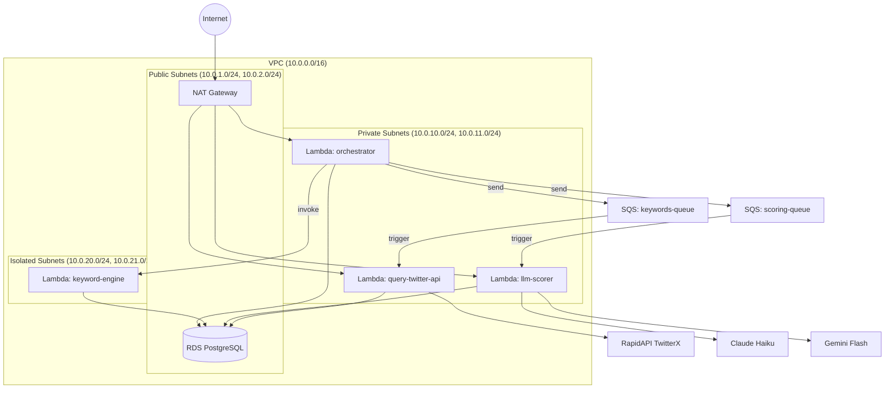
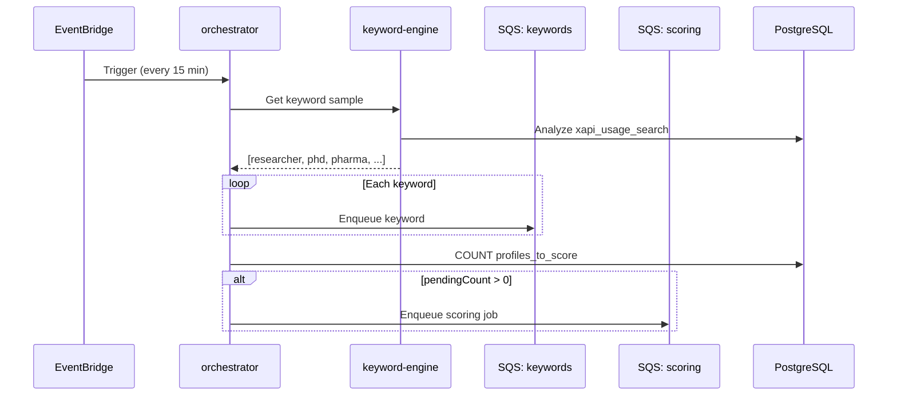
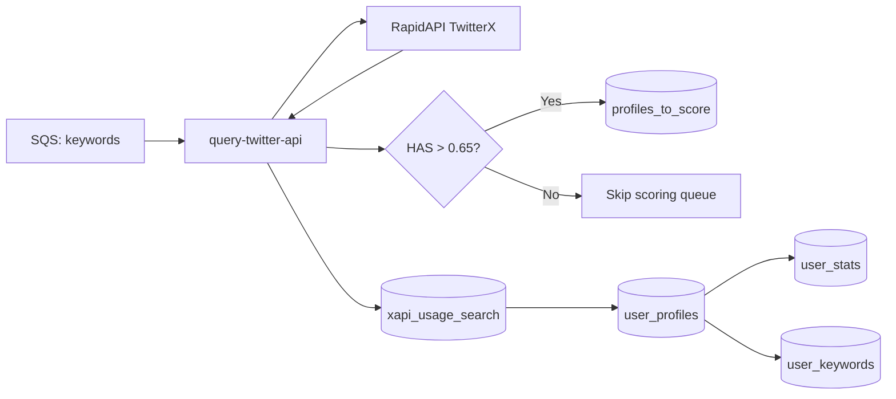
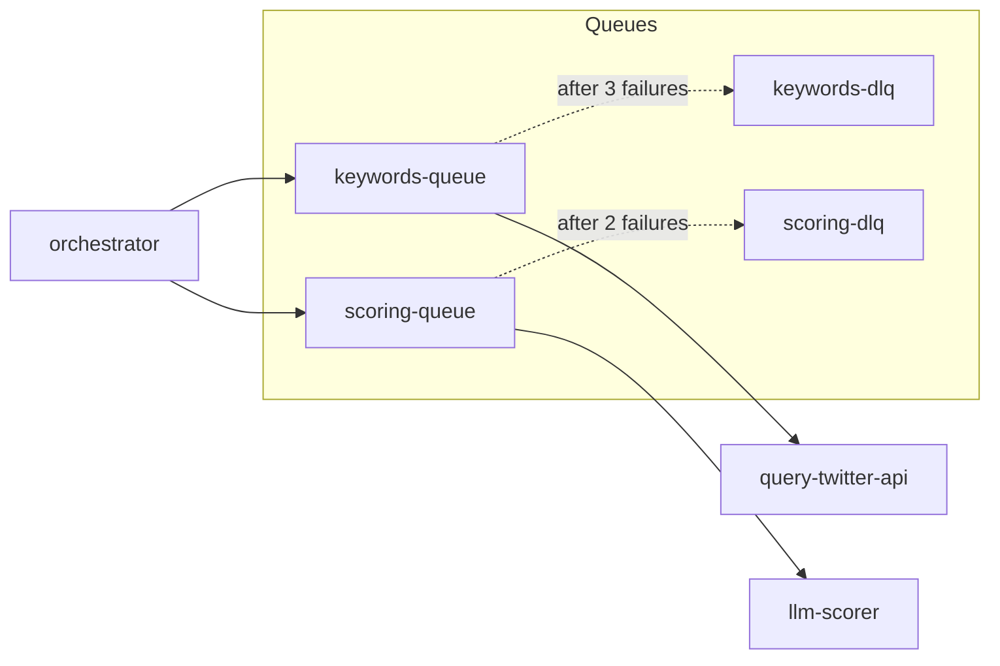
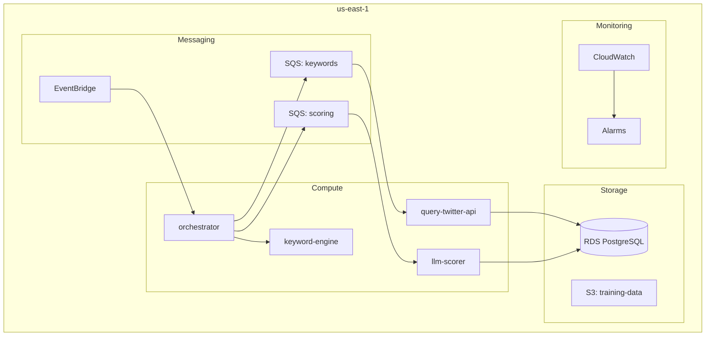

# System Architecture

## AWS Infrastructure

**Region:** us-east-2



## Subnet Layout

| Subnet Type | CIDR | Internet Access | Lambda Functions |
|-------------|------|-----------------|------------------|
| Public | 10.0.1.0/24, 10.0.2.0/24 | Direct (IGW) | - |
| Private | 10.0.10.0/24, 10.0.11.0/24 | Via NAT | orchestrator, query-twitter-api, llm-scorer |
| Isolated | 10.0.20.0/24, 10.0.21.0/24 | None | keyword-engine |

**Note:** RDS is in public subnets for dev access. Move to isolated subnets for production.

## Lambda Functions

### 1. Orchestrator

**Location:** `lambdas/orchestrator/`

**Subnet:** Private (needs NAT for AWS API calls)

**Trigger:** EventBridge Schedule (every 15 minutes)

**Responsibilities:**
- Heartbeat for the entire pipeline
- Query `keyword-engine` for keyword selection
- Enqueue keywords to SQS for collection
- Check `profiles_to_score` queue depth
- Trigger `llm-scorer` when work exists



### 2. Keyword Engine

**Location:** `lambdas/keyword-engine/`

**Subnet:** Isolated (DB access only)

**Trigger:** Invoked by orchestrator

**Responsibilities:**
- Select promising keywords based on historical success
- Analyze `xapi_usage_search` for keyword yield rates
- (Future) Extract keywords from high-scoring profiles

**Initial Implementation:** Return hardcoded sample:
```typescript
const SEED_KEYWORDS = ['researcher', 'phd', 'psychiatry', 'neuroscience', 'pharma'];
```

### 3. Query Twitter API

**Location:** `lambdas/query-twitter-api/`

**Subnet:** Private (internet via NAT)

**Trigger:** SQS `keywords-queue` (batch size = 1)

**Dependencies:** `@profile-scorer/twitterx-api` package

**Responsibilities:**
- Fetch profiles from RapidAPI TwitterX (via `twitterx-api` wrapper)
- Compute HAS (Human Authenticity Score) using sigmoid/tanh normalizations
- Store atomically to `user_profiles`, `user_stats`, `user_keywords`
- Queue high-HAS profiles (> 0.65) to `profiles_to_score`
- Track API usage in `xapi_usage_search`

**Key Implementation Details:**
- Uses `wrappers.processKeyword(keyword)` from `@profile-scorer/twitterx-api`
- Metadata inserted FIRST to satisfy FK constraint on `user_keywords.search_id`
- Winston logger for structured JSON logging in CloudWatch
- RDS SSL certificate bundled for secure DB connections



**Atomic Operation Flow:**
1. Insert `xapi_usage_search` metadata (generates UUID for FK)
2. For each user:
   - Insert/update `user_profiles`
   - Insert `user_keywords` (references search metadata)
   - Upsert `user_stats`
3. Filter profiles with HAS > 0.65
4. Insert filtered profiles to `profiles_to_score`

### 4. LLM Scorer

**Location:** `lambdas/llm-scorer/`

**Subnet:** Private (internet via NAT)

**Trigger:** SQS `scoring-queue` (batch size = 1)

**Responsibilities:**
- Fetch batch of 25 profiles from `profiles_to_score`
- Transform to TOON format
- Query LLM (Claude Haiku or Gemini Flash)
- Parse response, store to `profile_scores`
- Remove scored profiles from queue

## Message Queues



### Queue Configuration

| Queue | Visibility Timeout | Max Retries | DLQ Retention |
|-------|-------------------|-------------|---------------|
| `keywords-queue` | 60s | 3 | 7 days |
| `scoring-queue` | 120s | 2 | 7 days |

### Deployed Queue URLs (dev)

```
keywords-queue: https://sqs.us-east-2.amazonaws.com/.../keywords-queue-*
scoring-queue:  https://sqs.us-east-2.amazonaws.com/.../scoring-queue-*
```

## Rate Limiting Strategy

### RapidAPI TwitterX

- **Limit:** 10 requests/second, 500K requests/month
- **Strategy:** SQS reserved concurrency = 3

With 3 concurrent lambdas, each making sequential API calls:
- Effective rate: ~3 req/s (safe margin under 10)
- Monthly capacity: ~7.8M requests (well under 500K limit)

### LLM APIs

- **Claude Haiku:** $0.25/1M input, $1.25/1M output tokens
- **Gemini Flash:** Free tier
- **Strategy:** Small batches (25 profiles), TOON format

Estimated cost per 1000 profiles:
- ~40 batches × ~2K tokens/batch = 80K tokens
- Cost: ~$0.12 (Claude Haiku)

## Deployment Topology



## Resource Specifications

| Lambda | Memory | Timeout | Subnet |
|--------|--------|---------|--------|
| orchestrator | 256MB | 30s | Private |
| keyword-engine | 256MB | 30s | Isolated |
| query-twitter-api | 256MB | 60s | Private |
| llm-scorer | 512MB | 120s | Private |

## Pulumi Stack Outputs

```bash
# Database connection
uv run pulumi stack output db_connection_string --show-secrets

# Lambda ARNs
uv run pulumi stack output orchestrator_arn
uv run pulumi stack output keyword_engine_arn
uv run pulumi stack output query_twitter_arn
uv run pulumi stack output llm_scorer_arn

# Lambda names (for invocation)
uv run pulumi stack output orchestrator_name
uv run pulumi stack output keyword_engine_name
uv run pulumi stack output query_twitter_name
uv run pulumi stack output llm_scorer_name

# Queue URLs
uv run pulumi stack output keywords_queue_url
uv run pulumi stack output scoring_queue_url
uv run pulumi stack output keywords_dlq_url
uv run pulumi stack output scoring_dlq_url
```

## Testing the Pipeline

```bash
# Manually invoke orchestrator
aws lambda invoke --function-name $(uv run pulumi stack output orchestrator_name) \
  --payload '{}' /tmp/out.json && cat /tmp/out.json

# Check queue depths
aws sqs get-queue-attributes \
  --queue-url $(uv run pulumi stack output keywords_queue_url) \
  --attribute-names ApproximateNumberOfMessages

# View lambda logs
aws logs tail /aws/lambda/$(uv run pulumi stack output orchestrator_name) --since 5m
```
