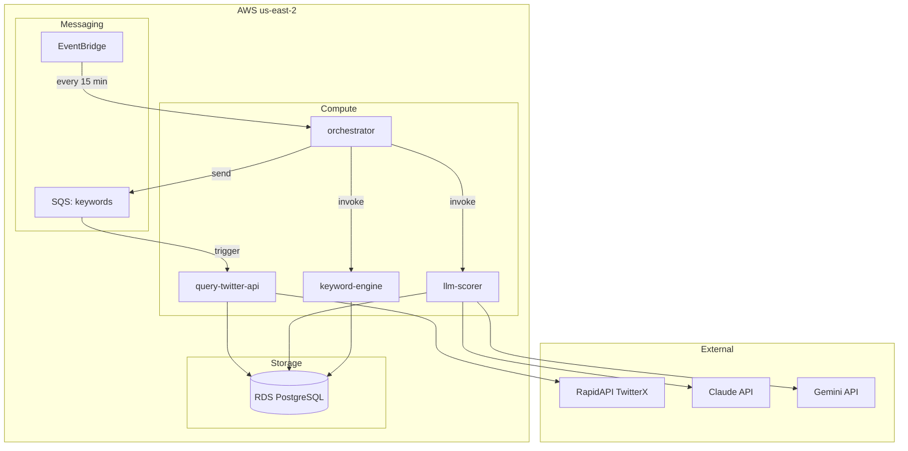
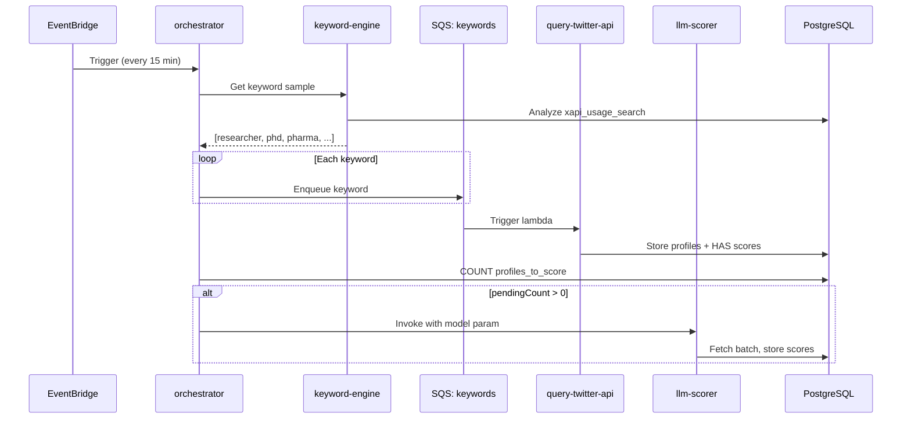
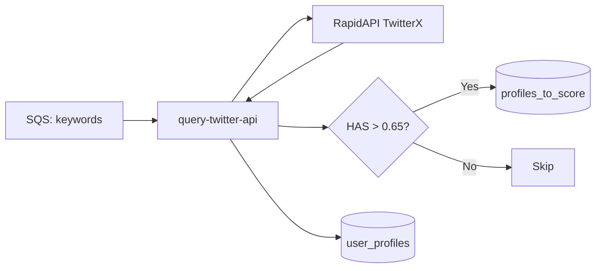
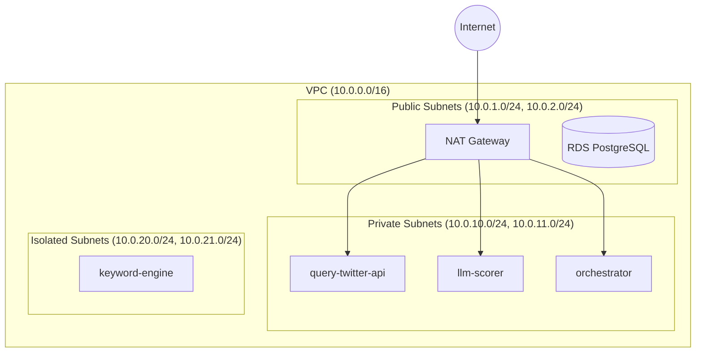
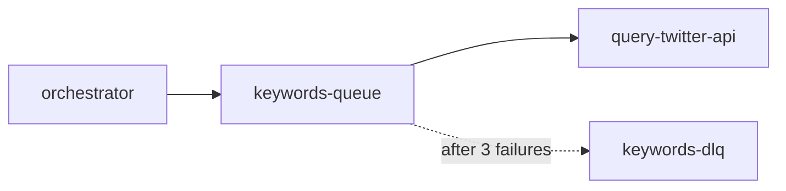

# System Architecture

## Overview



**Resource Group:** [`profile-scorer-saas`](https://console.aws.amazon.com/resource-groups) - View all resources in AWS Console

**Tags:** All resources are tagged with:
- `Project: profile-scorer-saas`
- `Environment: mvp`
- `ManagedBy: pulumi`

## Data Flow



## Lambda Functions

| Lambda | Memory | Timeout | Subnet | Trigger |
|--------|--------|---------|--------|---------|
| orchestrator | 256MB | 30s | Private | EventBridge (15 min) |
| keyword-engine | 256MB | 30s | Isolated | Direct invocation |
| query-twitter-api | 256MB | 60s | Private | SQS keywords-queue |
| llm-scorer | 512MB | 120s | Private | Direct invocation |

### 1. Orchestrator

**Location:** `lambdas/orchestrator/`

Pipeline heartbeat that coordinates all other lambdas:
- Invokes `keyword-engine` to get keyword list
- Sends keywords to SQS queue
- Invokes `llm-scorer` directly when profiles need scoring

### 2. Keyword Engine

**Location:** `lambdas/keyword-engine/`

Selects keywords for Twitter search:
- Currently returns hardcoded sample
- (Future) Analyzes `xapi_usage_search` for keyword effectiveness

### 3. Query Twitter API

**Location:** `lambdas/query-twitter-api/`

Fetches and processes Twitter profiles:
- Calls RapidAPI TwitterX
- Computes HAS (Human Authenticity Score)
- Stores to `user_profiles`, `user_stats`, `user_keywords`
- Queues high-HAS profiles (>0.65) to `profiles_to_score`



### 4. LLM Scorer

**Location:** `lambdas/llm-scorer/`

Evaluates profiles with LLMs:
- Fetches batch from `profiles_to_score` using `FOR UPDATE SKIP LOCKED`
- Sends to Claude or Gemini (model specified at invocation)
- Stores scores in `profile_scores`

## Network Architecture



| Subnet Type | CIDR | Internet Access | Purpose |
|-------------|------|-----------------|---------|
| Public | 10.0.1-2.0/24 | Direct (IGW) | NAT Gateway, RDS (dev) |
| Private | 10.0.10-11.0/24 | Via NAT | Lambdas needing external APIs |
| Isolated | 10.0.20-21.0/24 | None | DB-only lambdas |

**Note:** RDS is in public subnets for dev access. Move to isolated subnets for production.

## Message Queues



| Queue | Visibility Timeout | Max Retries | DLQ Retention |
|-------|-------------------|-------------|---------------|
| keywords-queue | 60s | 3 | 7 days |

**Note:** The scoring queue was removed. The `llm-scorer` is now invoked directly by the orchestrator. The `profiles_to_score` table serves as a persistent queue with atomic claims via `FOR UPDATE SKIP LOCKED`.

## Rate Limiting

### RapidAPI TwitterX
- **Limit:** 10 req/s, 500K req/month
- **Strategy:** SQS concurrency = 3 (~3 req/s effective)

### LLM APIs
- **Claude Haiku:** $0.25/1M input, $1.25/1M output
- **Gemini Flash:** Free tier
- **Batch size:** 25 profiles per request

## Pulumi Stack Outputs

```bash
# Database
uv run pulumi stack output db_connection_string --show-secrets

# Lambda ARNs
uv run pulumi stack output orchestrator_arn
uv run pulumi stack output keyword_engine_arn
uv run pulumi stack output query_twitter_arn
uv run pulumi stack output llm_scorer_arn

# Lambda names (for invocation)
uv run pulumi stack output orchestrator_name
uv run pulumi stack output keyword_engine_name
uv run pulumi stack output query_twitter_name
uv run pulumi stack output llm_scorer_name

# Queues
uv run pulumi stack output keywords_queue_url
uv run pulumi stack output keywords_dlq_url

# Resource Group
uv run pulumi stack output resource_group_arn
```

## Testing

```bash
# Invoke orchestrator
aws lambda invoke --function-name $(uv run pulumi stack output orchestrator_name) \
  --payload '{}' /tmp/out.json && cat /tmp/out.json

# Check queue depth
aws sqs get-queue-attributes \
  --queue-url $(uv run pulumi stack output keywords_queue_url) \
  --attribute-names ApproximateNumberOfMessages

# View logs
aws logs tail /aws/lambda/$(uv run pulumi stack output orchestrator_name) --since 5m
```
