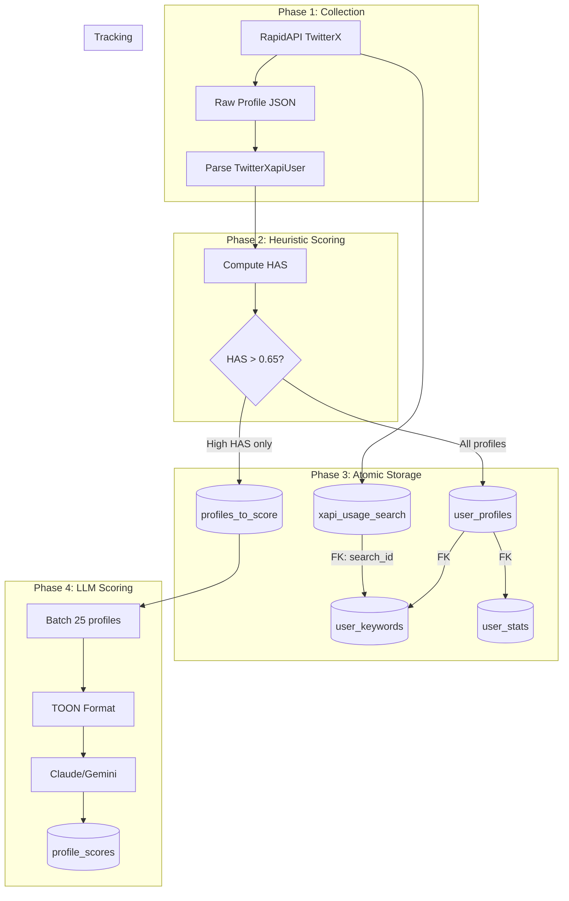
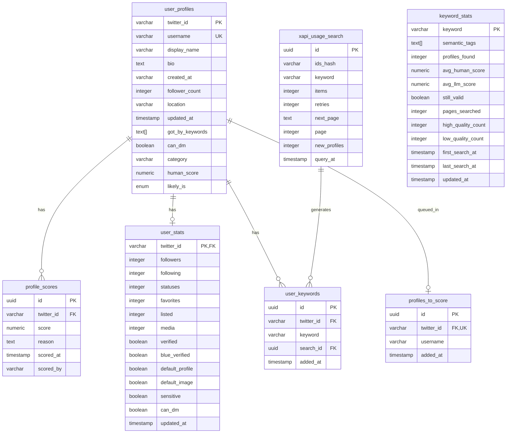

# Data Pipeline

## Data Flow Overview



**Important:** The HAS threshold for `profiles_to_score` is **0.65** (not 0.55). All profiles are stored in `user_profiles` regardless of HAS score, but only high-scoring profiles are queued for LLM evaluation.

## Database Schema

### Entity Relationship Diagram



## Table Details

### `user_profiles`

Primary storage for processed Twitter profiles.

| Column | Type | Description |
|--------|------|-------------|
| `twitter_id` | VARCHAR(25) | Primary key, Twitter's user ID |
| `username` | VARCHAR(255) | Twitter handle (unique) |
| `display_name` | VARCHAR(255) | Display name |
| `bio` | TEXT | Profile description |
| `created_at` | VARCHAR(100) | Account creation date (Twitter format) |
| `follower_count` | INTEGER | Number of followers |
| `location` | VARCHAR(255) | Self-reported location |
| `updated_at` | TIMESTAMP | Last update in our system |
| `got_by_keywords` | TEXT[] | Keywords that found this profile |
| `can_dm` | BOOLEAN | Whether DMs are open |
| `category` | VARCHAR(255) | Professional category (if set) |
| `human_score` | NUMERIC | HAS score (0.0000 - 1.0000) |
| `likely_is` | ENUM | Classification: Human, Creator, Entity, Bot, Other |

### `user_stats`

Raw numeric fields for HAS validation and future ML training.

| Column | Type | Description |
|--------|------|-------------|
| `twitter_id` | VARCHAR(25) | FK to user_profiles |
| `followers` | INTEGER | followers_count |
| `following` | INTEGER | friends_count |
| `statuses` | INTEGER | Tweet count |
| `favorites` | INTEGER | Likes given |
| `listed` | INTEGER | Lists containing user |
| `media` | INTEGER | Media uploads |
| `verified` | BOOLEAN | Legacy verification |
| `blue_verified` | BOOLEAN | Twitter Blue |
| `default_profile` | BOOLEAN | Using default theme |
| `default_image` | BOOLEAN | Using default avatar |
| `sensitive` | BOOLEAN | possibly_sensitive flag |
| `can_dm` | BOOLEAN | DMs open |

**Purpose:** Preserve raw fields to:
1. Validate/tune HAS heuristic over time
2. Generate training data for custom model
3. Enable retroactive re-scoring with improved heuristics

### `profiles_to_score`

FIFO queue for profiles awaiting LLM scoring.

| Column | Type | Description |
|--------|------|-------------|
| `id` | UUID | Primary key |
| `twitter_id` | VARCHAR(25) | FK to user_profiles (unique) |
| `username` | VARCHAR(255) | For quick reference |
| `added_at` | TIMESTAMP | Queue entry time (for FIFO) |

**Index:** `idx_added_at` for FIFO ordering

### `profile_scores`

LLM-generated scores, one per (profile, model) pair.

| Column | Type | Description |
|--------|------|-------------|
| `id` | UUID | Primary key |
| `twitter_id` | VARCHAR(25) | FK to user_profiles |
| `score` | NUMERIC(3,2) | LLM score (0.00 - 1.00) |
| `reason` | TEXT | LLM's reasoning |
| `scored_at` | TIMESTAMP | When scored |
| `scored_by` | VARCHAR(100) | Model identifier |

**Unique Constraint:** `(twitter_id, scored_by)` - one score per model

**Example `scored_by` values:**
- `claude-haiku-20241022`
- `gemini-2.0-flash`
- `mistral-7b-researcher-v1` (custom model)

### `xapi_usage_search`

API call tracking and pagination state.

| Column | Type | Description |
|--------|------|-------------|
| `id` | UUID | Primary key |
| `ids_hash` | VARCHAR(16) | Hash of returned IDs (dedup) |
| `keyword` | VARCHAR(255) | Search keyword |
| `items` | INTEGER | Requested items (default 20) |
| `retries` | INTEGER | Retry count |
| `next_page` | TEXT | Pagination cursor |
| `page` | INTEGER | Page number |
| `new_profiles` | INTEGER | New profiles found |
| `query_at` | TIMESTAMP | Query timestamp |

**Unique Constraint:** `(keyword, items, next_page)` - prevent duplicate queries

**Usage:**
1. Track keyword effectiveness: `AVG(new_profiles) GROUP BY keyword`
2. Resume pagination: `SELECT next_page WHERE keyword = ? ORDER BY page DESC LIMIT 1`
3. Monitor API quota: `COUNT(*) WHERE query_at > NOW() - INTERVAL '1 month'`

### `keyword_stats`

Keyword pool management with aggregated statistics. Updated daily by `keyword-stats-updater` lambda.

| Column | Type | Description |
|--------|------|-------------|
| `keyword` | VARCHAR(255) | Primary key, the search keyword |
| `semantic_tags` | TEXT[] | Semantic categorization tags (e.g., `#academia`, `#health`) |
| `profiles_found` | INTEGER | Total profiles found with this keyword |
| `avg_human_score` | NUMERIC(4,3) | Average HAS score of profiles |
| `avg_llm_score` | NUMERIC(4,3) | Average LLM score of profiles |
| `still_valid` | BOOLEAN | Whether keyword has more pagination pages |
| `pages_searched` | INTEGER | Number of pages searched |
| `high_quality_count` | INTEGER | Profiles with HAS > 0.7 |
| `low_quality_count` | INTEGER | Profiles with HAS < 0.4 |
| `first_search_at` | TIMESTAMP | First search timestamp |
| `last_search_at` | TIMESTAMP | Most recent search |
| `updated_at` | TIMESTAMP | Last stats recalculation |

**Semantic Tags:**
- `#academia` - Academic roles and institutions
- `#credentials` - Titles and qualifications (PhD, Professor)
- `#research` - Research-related roles
- `#health` / `#medical` - Health and medical research
- `#industry` / `#tech` - Industry and applied research
- `#qualitative` - Qualitative research methods
- `#humanities` - Humanities and cultural studies
- `#interdisciplinary` - Cross-disciplinary fields

**Usage:**
1. `keyword-engine` fetches valid keywords: `SELECT * FROM keyword_stats WHERE still_valid = true`
2. Daily stats update via `keyword-stats-updater` lambda (4 AM UTC)
3. Add new keywords: `yarn add-keyword "new term" --tags=#academia,#research`

### `user_keywords`

Many-to-many: profiles found by which keywords.

| Column | Type | Description |
|--------|------|-------------|
| `id` | UUID | Primary key |
| `twitter_id` | VARCHAR(25) | FK to user_profiles |
| `keyword` | VARCHAR(255) | Search keyword |
| `search_id` | UUID | FK to xapi_usage_search |
| `added_at` | TIMESTAMP | When association created |

**Unique Constraint:** `(twitter_id, keyword)` - one entry per pair

## API Functions

The `@profile-scorer/twitterx-api` package provides two main API functions:

### `xapiSearch(keyword, items, cursor, page)`

Searches for Twitter profiles by keyword. Used by `query-twitter-api` lambda.

```typescript
const { users, metadata } = await xapiSearch("researcher", 20, null, 0);
```

### `xapiGetUser(username)`

Fetches a single user by username. Used for curated profile uploads.

```typescript
const user = await xapiGetUser("DrJaneSmith");
```

### Error Handling

Both functions throw `TwitterXApiError` with standardized error codes:

| Error Code | HTTP Status | Description |
|------------|-------------|-------------|
| `API_KEY_MISSING` | 401 | TWITTERX_APIKEY not set |
| `RATE_LIMITED` | 429 | API rate limit exceeded |
| `USER_NOT_FOUND` | 404 | User doesn't exist |
| `USER_SUSPENDED` | 403 | User account suspended |
| `MAX_RETRIES_EXCEEDED` | 503 | Failed after 10 retry attempts |
| `NETWORK_ERROR` | 502 | Network/connection error |
| `API_BOTTLENECK` | 503 | API returned empty response |

```typescript
import { TwitterXApiError } from "@profile-scorer/twitterx-api";

try {
  const user = await xapiGetUser("username");
} catch (e) {
  if (e instanceof TwitterXApiError) {
    if (e.is("USER_NOT_FOUND")) {
      // Handle missing user
    } else if (e.is("RATE_LIMITED")) {
      // Back off and retry later
    }
  }
}
```

### Pagination Utilities

Check if a keyword has more pages available:

```typescript
import { keywordStillHasPages } from "@profile-scorer/twitterx-api";

const hasMore = await keywordStillHasPages("researcher");
// true if never searched or has next_page cursor
```

## Data Transformations

### RapidAPI Response → Storage

The transformation is handled by `@profile-scorer/twitterx-api` package:

```typescript
// Input: TwitterXapiUser from RapidAPI
interface TwitterXapiUser {
  rest_id: string;
  is_blue_verified: boolean;
  legacy: {
    screen_name: string;
    name: string;
    description: string;
    created_at: string;
    followers_count: number;
    friends_count: number;
    statuses_count: number;
    favourites_count: number;
    listed_count: number;
    media_count: number;
    location: string;
    can_dm: boolean;
    default_profile: boolean;
    default_profile_image: boolean;
    possibly_sensitive: boolean;
    verified: boolean;
  };
  professional?: {
    category: { name: string }[];
  };
}

// Processing flow (see packages/twitterx-api/src/wrappers.ts):
// 1. xapi_usage_search - inserted FIRST (provides search_id for FK)
// 2. user_profiles - core fields + computed HAS score
// 3. user_keywords - keyword association (FK to xapi_usage_search)
// 4. user_stats - raw numeric fields (FK to user_profiles)
// 5. profiles_to_score - if HAS > 0.65
```

**Atomic Operations:** Each profile is processed atomically. The `upsertUserProfile` function:
1. Inserts new profile OR updates existing (via unique constraint catch)
2. Always inserts `user_keywords` relation (for both new and existing profiles)
3. Upserts `user_stats` with `onConflictDoUpdate`

This ensures data consistency even when the same profile is found by multiple keywords.

### Profile → TOON Format (LLM Input)

```typescript
interface ParamsScoreProfile {
  username: string;
  display_name: string | null;
  bio: string | null;
  likely_is: string;
  category: string | null;
}

// Example TOON prompt:
`Score these profiles. Return JSON array with: handle, score (0.00-1.00), reason.

PROFILES:
1. @researcher_jane | Jane Smith PhD | "Neuroscience researcher at MIT. Published 50+ papers." | Human | Scientist
2. @pharma_news | PharmaCorp News | "Official news from PharmaCorp Inc." | Entity | Pharmaceutical Company
...

OUTPUT:`
```

### LLM Response → Storage

```typescript
interface ScoredUser {
  username: string;  // Maps to twitter_id via lookup
  score: number;     // 0.00 - 1.00
  reason: string;    // LLM reasoning
}

// Stored in profile_scores with:
// - scored_by: model identifier
// - scored_at: NOW()
```

## Query Patterns

### Get profiles ready for LLM scoring

```sql
SELECT p.twitter_id, p.username, p.display_name, p.bio, p.likely_is, p.category
FROM profiles_to_score pts
JOIN user_profiles p ON pts.twitter_id = p.twitter_id
WHERE NOT EXISTS (
    SELECT 1 FROM profile_scores ps
    WHERE ps.twitter_id = pts.twitter_id
    AND ps.scored_by = 'claude-haiku-20241022'
)
ORDER BY pts.added_at ASC
LIMIT 25;
```

### Keyword effectiveness report

```sql
SELECT
    keyword,
    COUNT(*) as searches,
    SUM(new_profiles) as total_new,
    AVG(new_profiles)::numeric(5,2) as avg_per_search
FROM xapi_usage_search
WHERE query_at > NOW() - INTERVAL '7 days'
GROUP BY keyword
ORDER BY avg_per_search DESC;
```

### Final ranked profiles

```sql
SELECT
    p.username,
    p.display_name,
    p.human_score as has_score,
    ps.score as llm_score,
    ps.scored_by,
    -- Combined score (example weighting)
    (0.3 * p.human_score + 0.7 * ps.score)::numeric(4,3) as final_score
FROM user_profiles p
JOIN profile_scores ps ON p.twitter_id = ps.twitter_id
WHERE ps.scored_by = 'claude-haiku-20241022'
ORDER BY final_score DESC
LIMIT 100;
```
