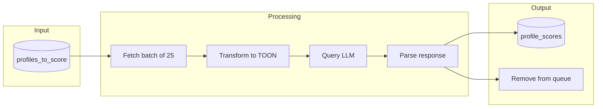
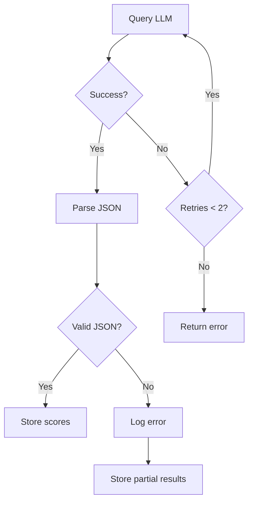

# LLM Scoring

## Overview

The LLM scoring phase evaluates profiles that passed the HAS (Human Authenticity Score) threshold. It uses commercial LLMs (Claude Haiku, Gemini Flash) to assess researcher relevance, then combines with HAS for a final score.

## Scoring Pipeline



## TOON Format

**TOON** (Tabular Object Output Notation) is a structured prompt format that reduces hallucination and ensures consistent output.

### Prompt Template

```
You are evaluating Twitter profiles to identify academic researchers in qualitative research, psychiatry, neuroscience, and pharma.

Score each profile from 0.00 to 1.00 based on likelihood they are a real human who is an academic researcher in these fields.

Scoring guidelines:
- 0.90-1.00: Clear academic researcher (PhD, professor, published researcher)
- 0.70-0.89: Likely researcher (research assistant, grad student, research-adjacent)
- 0.50-0.69: Possibly relevant (industry researcher, science communicator)
- 0.30-0.49: Unlikely but possible (tangentially related field)
- 0.00-0.29: Not a researcher (organization, bot, unrelated field)

PROFILES:
{{#each profiles}}
{{@index}}. @{{username}} | {{display_name}} | "{{bio}}" | {{likely_is}} | {{category}}
{{/each}}

Return a JSON array with objects containing: handle, score, reason (brief).
Only return the JSON array, no other text.
```

### Example Input

```
PROFILES:
1. @neuro_jane | Dr. Jane Smith | "Neuroscience researcher @MIT. Studying memory formation. Published 50+ papers. She/her" | Human | Scientist
2. @pharma_bob | Bob Johnson | "20 years in pharma R&D. Now consulting. Golf enthusiast." | Human | null
3. @research_org | Research Institute | "Official account of the National Research Institute" | Entity | Research Organization
```

### Expected Output

```json
[
  {
    "handle": "neuro_jane",
    "score": 0.95,
    "reason": "PhD neuroscientist at MIT with publication record"
  },
  {
    "handle": "pharma_bob",
    "score": 0.65,
    "reason": "Industry experience but no current research role"
  },
  {
    "handle": "research_org",
    "score": 0.15,
    "reason": "Organization account, not individual researcher"
  }
]
```

## Model Configuration

### Claude Haiku 4.5

```typescript
const CLAUDE_CONFIG = {
  model: "claude-haiku-4-5-20251001",
  max_tokens: 2048,
  temperature: 0.1, // Low for consistency
};
```

**Cost estimate:** ~$0.25/1M input, $1.25/1M output tokens

### Gemini Flash

```typescript
const GEMINI_CONFIG = {
  model: "gemini-2.0-flash",
  maxOutputTokens: 2048,
  temperature: 0.1,
};
```

**Cost:** Free tier

## Final Score Computation

The final score combines HAS (heuristic) with LLM scores from multiple models.

### Official Formula (Implemented)

```
FINAL_SCORE = 0.2 × HAS + 0.8 × AVG_LLM
```

Where:

- **HAS**: Human Authenticity Score (heuristic-based, 0-1)
- **AVG_LLM**: Average of all LLM scores for the profile (0-1)

**Rationale:** LLMs are weighted higher (0.8) because they evaluate the actual relevance of the profile to our target audience (qualitative researchers), while HAS only measures authenticity/bot likelihood. A profile can be highly authentic (HAS=0.9) but irrelevant (e.g., a sports blogger), or vice versa.

### Multi-Model Averaging

Each profile can be scored by multiple LLMs. The `AVG_LLM` is computed as:

```
AVG_LLM = (S_haiku + S_sonnet + S_gemini + ...) / N_models
```

This provides:

1. **Robustness**: Reduces single-model bias
2. **Confidence**: More models = more reliable score
3. **Cost efficiency**: Mix expensive (Sonnet) with cheap (Haiku, Gemini)

### Filtering Threshold

Only profiles with `FINAL_SCORE >= 0.6` are exported for targeting:

| Score Range | Interpretation  | Action               |
| ----------- | --------------- | -------------------- |
| 0.8 - 1.0   | Excellent match | High priority target |
| 0.7 - 0.8   | Good match      | Target               |
| 0.6 - 0.7   | Acceptable      | Include              |
| < 0.6       | Weak match      | Exclude              |

### SQL Query (Multi-Model)

```sql
-- Final ranking with averaged LLM scores
SELECT
    p.username,
    p.human_score as has,
    AVG(ps.score)::numeric(4,3) as avg_llm,
    (0.2 * p.human_score + 0.8 * AVG(ps.score))::numeric(4,3) as final_score
FROM user_profiles p
JOIN profile_scores ps ON p.twitter_id = ps.twitter_id
GROUP BY p.twitter_id, p.username, p.human_score
HAVING (0.2 * p.human_score + 0.8 * AVG(ps.score)) >= 0.6
ORDER BY final_score DESC;
```

### Alternative Strategies (Not Used)

**Strategy 2: Multiplicative**

```
S_final = S_HAS × S_LLM
```

Penalizes profiles that score low on either metric. Too aggressive.

**Strategy 3: Gated**

```
S_final = S_LLM if S_HAS >= 0.55, else S_LLM × S_HAS
```

Use HAS as a gate/penalty only. Complex without clear benefit.

## Lambda Implementation

### Handler Structure

```typescript
// lambdas/llm-scorer/src/handler.ts
interface ScoringEvent {
  model: string;
  batchSize?: number;
  audienceConfigPath?: string; // e.g., "thelai_customers.v1"
}

export const handler = async (event: ScoringEvent) => {
  const { model, batchSize = 25, audienceConfigPath = "thelai_customers.v1" } = event;

  // 1. Fetch profiles using FOR UPDATE SKIP LOCKED (atomic claim)
  const profiles = await fetchProfilesToScore(model, batchSize);
  if (profiles.length === 0) return { scored: 0 };

  // 2. Transform to TOON format
  const prompt = buildTOONPrompt(profiles);

  // 3. Query LLM
  const response = await queryLLM(model, prompt);

  // 4. Parse and store scores
  const scores = parseResponse(response);
  await storeScores(scores, model);

  // 5. Remove from profiles_to_score
  await removeFromQueue(profiles.map((p) => p.twitter_id));

  return { scored: scores.length };
};
```

### Error Handling



## Multi-Model Scoring

Run multiple models in parallel for comparison:

```typescript
// Orchestrator invokes llm-scorer directly for each model
const models = ["claude-haiku-4-5-20251001", "gemini-2.0-flash"];
for (const model of models) {
  await lambda.invoke("llm-scorer", { model, batchSize: 25 });
}
```

### Model Agreement Analysis

```sql
-- Find profiles where models disagree
SELECT
    p.username,
    ch.score as claude_score,
    gf.score as gemini_score,
    ABS(ch.score - gf.score) as disagreement
FROM user_profiles p
JOIN profile_scores ch ON p.twitter_id = ch.twitter_id AND ch.scored_by LIKE 'claude%'
JOIN profile_scores gf ON p.twitter_id = gf.twitter_id AND gf.scored_by LIKE 'gemini%'
WHERE ABS(ch.score - gf.score) > 0.3
ORDER BY disagreement DESC;
```

## Validation

### Seed Profile Test

The 50 curated researcher profiles should score highly:

```sql
-- Validate seed profiles rank at top
WITH ranked AS (
    SELECT
        p.username,
        (0.3 * p.human_score + 0.7 * ps.score) as final_score,
        RANK() OVER (ORDER BY (0.3 * p.human_score + 0.7 * ps.score) DESC) as rank
    FROM user_profiles p
    JOIN profile_scores ps ON p.twitter_id = ps.twitter_id
    WHERE ps.scored_by = 'claude-haiku-4-5-20251001'
)
SELECT
    COUNT(*) FILTER (WHERE rank <= 50) as seed_in_top_50,
    COUNT(*) FILTER (WHERE rank <= 100) as seed_in_top_100,
    AVG(rank) as avg_seed_rank
FROM ranked
WHERE username IN (/* 50 seed usernames */);
```

**Success criteria:**

- At least 40/50 seeds in top 100
- Average seed rank < 75


## Audience Versioning

Each scoring run records which audience configuration was used, enabling:
- **Reproducibility**: Track which criteria were applied to each score
- **A/B testing**: Compare scoring accuracy across different audience definitions
- **Iteration**: Update targeting criteria without losing historical context

### Database Schema

```sql
-- profile_scores table includes audience version
CREATE TABLE profile_scores (
    id UUID PRIMARY KEY,
    twitter_id VARCHAR(25) REFERENCES user_profiles(twitter_id),
    label BOOLEAN,        -- true=match, false=no match, null=uncertain
    reason TEXT,
    scored_at TIMESTAMP,
    scored_by VARCHAR(100),  -- full model name (e.g., "claude-haiku-4-5-20251001")
    audience VARCHAR(100)    -- audience config (e.g., "thelai_customers.v1")
);
```

### Audience Config Files

Located in `lambdas/llm-scorer/src/audiences/`:
- `thelai_customers.v1.json` - Current version for TheLai customers

Config files define target profile criteria, domain context, and scoring signals.

### Version History

| Version | Description | Date |
|---------|-------------|------|
| `thelai_customers.v0` | Initial scoring criteria (implicit) | Pre Nov 30, 2025 |
| `thelai_customers.v1` | First explicit versioned config | Nov 30, 2025 |

## UPDATE Scoring Guidelines

### Label = `true` if ANY of:
- Bio mentions: qualitative research, ethnography, grounded theory, 
  thematic analysis, interviews, focus groups, mixed methods
- Academic role + research context (PhD student, professor, postdoc 
  in social sciences, psychology, education, nursing, public health)
- Works at research institution + mentions studies/data collection

### Label = `false` if ANY of:
- Organization/company account (not individual)
- Bot indicators (no bio, default image, suspicious patterns)
- Quantitative-only researcher (statistician, data scientist, ML)
- Journalist, marketer, or content creator
- No research connection whatsoever

### Label = `null` if:
- Bio is empty or ambiguous
- Can't determine if individual or org
- Language barrier prevents understanding

```typescript
export function generateSystemPrompt(config: AudienceConfig): string {
  return `ROLE: You are an expert at evaluating social media profiles to identify ${config.targetProfile}s in ${config.sector.toUpperCase()}.

## Domain Context
${config.domainContext}

## Scoring Signals

HIGH-SIGNAL INDICATORS (increase score):
${config.highSignals.map((s) => `• ${s}`).join("\n")}

LOW-SIGNAL INDICATORS (decrease score or neutral):
${config.lowSignals.map((s) => `• ${s}`).join("\n")}

## Evaluation Process
For each profile:
1. Analyze handle, name, bio, and category
2. Identify HIGH-SIGNAL indicators, these often appear as domain expertise, topics, or affiliations rather than explicit role titles
3. Weight: relevant affiliation + role alignment + domain keywords as strong proxy
4. Determine likelihood of being a ${config.targetProfile}

## Scoring Guidelines
- true: clear alignment with ${config.targetProfile} profile
- false: Bot, spam, or unaligned profile
- null: ambiguous, unclear relevance, empty bio

Respond with a JSON array. Each object must have:
- handle: string (profile's handle)
- label: boolean|null (is a "${config.targetProfile}"?)
- reason: string (brief explanation, max 100 chars)

IMPORTANT: Return ONLY the JSON array. No markdown formatting, no code blocks.
Return: [{ "handle": string, "label": boolean|null, "reason": string }]`;
}
```
