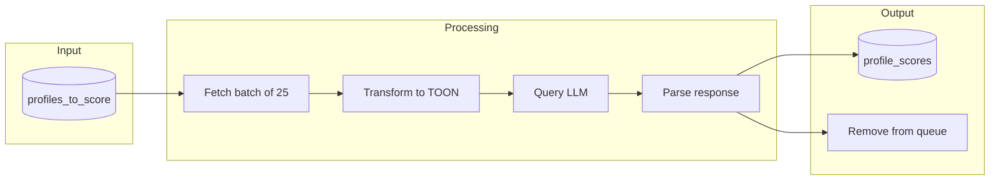
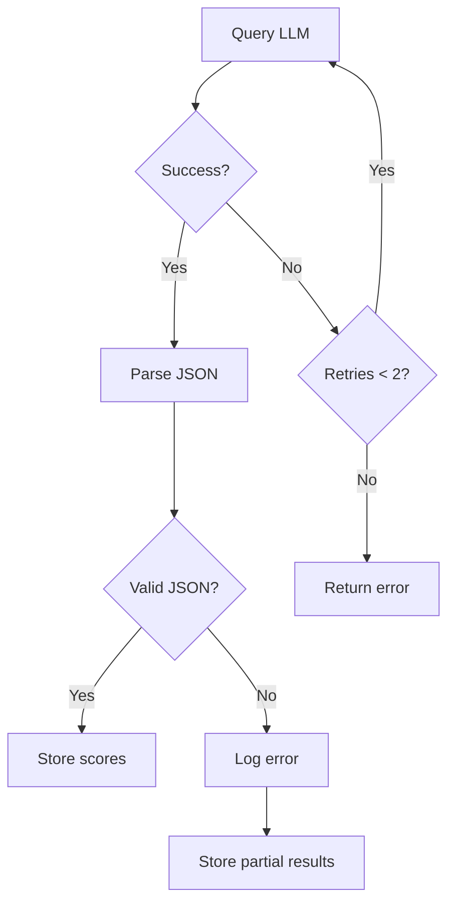

# LLM Scoring

## Overview

The LLM scoring phase evaluates profiles that passed the HAS (Human Authenticity Score) threshold. It uses commercial LLMs (Claude Haiku, Gemini Flash) to assess researcher relevance, then combines with HAS for a final score.

## Scoring Pipeline



## TOON Format

**TOON** (Tabular Object Output Notation) is a structured prompt format that reduces hallucination and ensures consistent output.

### Prompt Template

```
You are evaluating Twitter profiles to identify academic researchers in qualitative research, psychiatry, neuroscience, and pharma.

Score each profile from 0.00 to 1.00 based on likelihood they are a real human who is an academic researcher in these fields.

Scoring guidelines:
- 0.90-1.00: Clear academic researcher (PhD, professor, published researcher)
- 0.70-0.89: Likely researcher (research assistant, grad student, research-adjacent)
- 0.50-0.69: Possibly relevant (industry researcher, science communicator)
- 0.30-0.49: Unlikely but possible (tangentially related field)
- 0.00-0.29: Not a researcher (organization, bot, unrelated field)

PROFILES:
{{#each profiles}}
{{@index}}. @{{username}} | {{display_name}} | "{{bio}}" | {{likely_is}} | {{category}}
{{/each}}

Return a JSON array with objects containing: handle, score, reason (brief).
Only return the JSON array, no other text.
```

### Example Input

```
PROFILES:
1. @neuro_jane | Dr. Jane Smith | "Neuroscience researcher @MIT. Studying memory formation. Published 50+ papers. She/her" | Human | Scientist
2. @pharma_bob | Bob Johnson | "20 years in pharma R&D. Now consulting. Golf enthusiast." | Human | null
3. @research_org | Research Institute | "Official account of the National Research Institute" | Entity | Research Organization
```

### Expected Output

```json
[
  {"handle": "neuro_jane", "score": 0.95, "reason": "PhD neuroscientist at MIT with publication record"},
  {"handle": "pharma_bob", "score": 0.65, "reason": "Industry experience but no current research role"},
  {"handle": "research_org", "score": 0.15, "reason": "Organization account, not individual researcher"}
]
```

## Model Configuration

### Claude Haiku 4.5

```typescript
const CLAUDE_CONFIG = {
  model: "claude-haiku-4-5-20251001",
  max_tokens: 2048,
  temperature: 0.1,  // Low for consistency
};
```

**Cost estimate:** ~$0.25/1M input, $1.25/1M output tokens

### Gemini Flash

```typescript
const GEMINI_CONFIG = {
  model: "gemini-2.0-flash",
  maxOutputTokens: 2048,
  temperature: 0.1,
};
```

**Cost:** Free tier

## Final Score Computation

The final score combines HAS (heuristic) with LLM score. Several combination strategies:

### Strategy 1: Weighted Average

```
S_final = α × S_HAS + (1 - α) × S_LLM
```

Where α = 0.3 (weight HAS less since LLM is more accurate for relevance).

### Strategy 2: Multiplicative

```
S_final = S_HAS × S_LLM
```

Penalizes profiles that score low on either metric.

### Strategy 3: Gated

```
S_final =
  S_LLM                 if S_HAS >= 0.55
  S_LLM × S_HAS         if 0.40 <= S_HAS < 0.55
  0                     if S_HAS < 0.40
```

Use HAS as a gate/penalty only.

### Recommended: Strategy 1 with α = 0.3

```sql
-- Final ranking query
SELECT
    p.username,
    p.human_score as has,
    ps.score as llm,
    (0.3 * p.human_score + 0.7 * ps.score)::numeric(4,3) as final
FROM user_profiles p
JOIN profile_scores ps ON p.twitter_id = ps.twitter_id
WHERE ps.scored_by = 'claude-haiku-4-5-20251001'
ORDER BY final DESC;
```

## Lambda Implementation

### Handler Structure

```typescript
// lambdas/llm-scorer/src/handler.ts
interface ScoringEvent {
  model: string;
  batchSize?: number;
}

export const handler = async (event: ScoringEvent) => {
  const { model, batchSize = 25 } = event;

  // 1. Fetch profiles using FOR UPDATE SKIP LOCKED (atomic claim)
  const profiles = await fetchProfilesToScore(model, batchSize);
  if (profiles.length === 0) return { scored: 0 };

  // 2. Transform to TOON format
  const prompt = buildTOONPrompt(profiles);

  // 3. Query LLM
  const response = await queryLLM(model, prompt);

  // 4. Parse and store scores
  const scores = parseResponse(response);
  await storeScores(scores, model);

  // 5. Remove from profiles_to_score
  await removeFromQueue(profiles.map(p => p.twitter_id));

  return { scored: scores.length };
};
```

### Error Handling



## Multi-Model Scoring

Run multiple models in parallel for comparison:

```typescript
// Orchestrator invokes llm-scorer directly for each model
const models = ['claude-haiku-4-5-20251001', 'gemini-2.0-flash'];
for (const model of models) {
  await lambda.invoke('llm-scorer', { model, batchSize: 25 });
}
```

### Model Agreement Analysis

```sql
-- Find profiles where models disagree
SELECT
    p.username,
    ch.score as claude_score,
    gf.score as gemini_score,
    ABS(ch.score - gf.score) as disagreement
FROM user_profiles p
JOIN profile_scores ch ON p.twitter_id = ch.twitter_id AND ch.scored_by LIKE 'claude%'
JOIN profile_scores gf ON p.twitter_id = gf.twitter_id AND gf.scored_by LIKE 'gemini%'
WHERE ABS(ch.score - gf.score) > 0.3
ORDER BY disagreement DESC;
```

## Validation

### Seed Profile Test

The 50 curated researcher profiles should score highly:

```sql
-- Validate seed profiles rank at top
WITH ranked AS (
    SELECT
        p.username,
        (0.3 * p.human_score + 0.7 * ps.score) as final_score,
        RANK() OVER (ORDER BY (0.3 * p.human_score + 0.7 * ps.score) DESC) as rank
    FROM user_profiles p
    JOIN profile_scores ps ON p.twitter_id = ps.twitter_id
    WHERE ps.scored_by = 'claude-haiku-4-5-20251001'
)
SELECT
    COUNT(*) FILTER (WHERE rank <= 50) as seed_in_top_50,
    COUNT(*) FILTER (WHERE rank <= 100) as seed_in_top_100,
    AVG(rank) as avg_seed_rank
FROM ranked
WHERE username IN (/* 50 seed usernames */);
```

**Success criteria:**
- At least 40/50 seeds in top 100
- Average seed rank < 75
