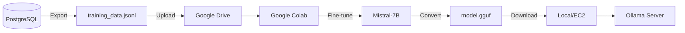
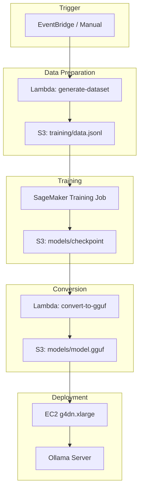
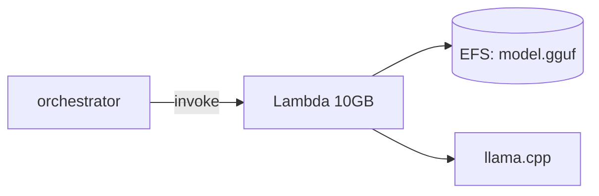
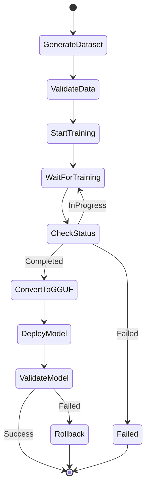
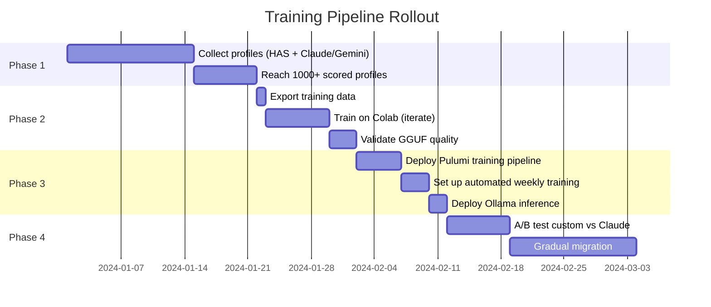

# Training Pipeline (Phase 2)

## Overview

Once sufficient `profile_scores` data exists, train a custom Mistral-7B model to reduce dependency on commercial LLM APIs.

## Architecture Options

### Option A: Google Colab (Current - R&D Phase)



**Pros:** Zero cost, quick iteration
**Cons:** Manual, session limits, unreliable GPU availability

### Option B: AWS Pipeline (Production)



## Training Data Format

### Source: `profile_scores` + `user_profiles`

```sql
SELECT
    p.username as handle,
    p.display_name,
    p.bio,
    p.likely_is,
    p.category,
    ps.score,
    ps.reason,
    ps.scored_by
FROM profile_scores ps
JOIN user_profiles p ON ps.twitter_id = p.twitter_id
WHERE ps.scored_by IN ('claude-haiku-20240307', 'gemini-2.0-flash')
ORDER BY ps.scored_at DESC;
```

### JSONL Format

```jsonl
{"instruction":"Score this profile...","output":"{\"handle\":\"neuro_jane\",\"score\":\"0.95\",\"reason\":\"PhD neuroscientist...\"}"}
{"instruction":"Score this profile...","output":"{\"handle\":\"pharma_bob\",\"score\":\"0.65\",\"reason\":\"Industry experience...\"}"}
```

### Instruction Template

```
Score this profile. Given the following profile attributes, return a JSON object with: 'handle', 'score' (0.00-1.00 likelihood of being a real person who is an academic researcher), 'reason'.

PROFILE ATTRIBUTES:
handle: {{username}}
displayName: {{display_name}}
bio: {{bio}}
created_at: {{created_at}}
followerCount: {{follower_count}}
location: {{location}}
(Scored by model: {{scored_by}})
```

## Model Configuration

### Base Model

```yaml
model: mistralai/Mistral-7B-Instruct-v0.2
method: LoRA / QLoRA
```

### LoRA Parameters

```python
lora_config = LoraConfig(
    r=16,                    # LoRA rank
    lora_alpha=32,           # Scaling factor
    target_modules=["q_proj", "v_proj", "k_proj", "o_proj"],
    lora_dropout=0.05,
    bias="none",
    task_type="CAUSAL_LM"
)
```

### Training Hyperparameters

```python
training_args = TrainingArguments(
    output_dir="./results",
    num_train_epochs=3,
    per_device_train_batch_size=4,
    gradient_accumulation_steps=4,
    learning_rate=2e-4,
    warmup_ratio=0.03,
    lr_scheduler_type="cosine",
    fp16=True,  # or bf16 on newer GPUs
    logging_steps=10,
    save_strategy="epoch",
)
```

## AWS Resources

### SageMaker Training Job

```python
# Pulumi (Python)
training_job = aws.sagemaker.TrainingJob(
    "researcher-scorer-training",
    algorithm_specification={
        "training_image": "763104351884.dkr.ecr.us-east-1.amazonaws.com/huggingface-pytorch-training:2.0.0-transformers4.28.1-gpu-py310-cu118-ubuntu20.04",
        "training_input_mode": "File",
    },
    resource_config={
        "instance_type": "ml.g4dn.xlarge",  # 1x T4 GPU
        "instance_count": 1,
        "volume_size_in_gb": 50,
    },
    stopping_condition={
        "max_runtime_in_seconds": 7200,  # 2 hours max
    },
    input_data_config=[{
        "channel_name": "training",
        "data_source": {
            "s3_data_source": {
                "s3_uri": f"s3://{bucket.id}/training/",
                "s3_data_type": "S3Prefix",
            }
        }
    }],
    output_data_config={
        "s3_output_path": f"s3://{bucket.id}/models/",
    },
)
```

### Cost Estimates

| Resource                    | Hourly Cost | Estimated Usage | Monthly Cost |
| --------------------------- | ----------- | --------------- | ------------ |
| SageMaker ml.g4dn.xlarge    | $0.736      | 4 hrs/week      | ~$12         |
| EC2 g4dn.xlarge (inference) | $0.526      | On-demand       | ~$0.50/run   |
| EC2 g4dn.xlarge (spot)      | ~$0.16      | On-demand       | ~$0.15/run   |
| S3 storage                  | $0.023/GB   | 20GB            | ~$0.50       |

**Total (weekly training):** ~$15/month

### Alternative: Lambda + EFS

For inference, consider serverless:



**Tradeoffs:**

- Cold start: ~30-60s (loading 14.5GB model)
- Max timeout: 15 minutes
- Cost: Pay per invocation only
- Complexity: Custom runtime needed

## GGUF Conversion

### Script

```python
# convert_to_gguf.py
from transformers import AutoModelForCausalLM, AutoTokenizer
import subprocess

# Load fine-tuned model
model = AutoModelForCausalLM.from_pretrained("./results/checkpoint-final")
tokenizer = AutoTokenizer.from_pretrained("./results/checkpoint-final")

# Save in HuggingFace format
model.save_pretrained("./hf_model")
tokenizer.save_pretrained("./hf_model")

# Convert to GGUF using llama.cpp
subprocess.run([
    "python", "llama.cpp/convert.py",
    "./hf_model",
    "--outtype", "q4_k_m",  # 4-bit quantization
    "--outfile", "./model-q4_k_m.gguf"
])
```

### Quantization Options

| Quantization | Size (7B) | Quality    | Speed   |
| ------------ | --------- | ---------- | ------- |
| f16          | ~14GB     | Best       | Slowest |
| q8_0         | ~7GB      | Very Good  | Fast    |
| q4_k_m       | ~4GB      | Good       | Faster  |
| q4_0         | ~3.5GB    | Acceptable | Fastest |

**Recommendation:** `q4_k_m` for balance of quality/size.

## Deployment with Ollama

### Modelfile

```dockerfile
FROM ./mistral-researcher-q4_k_m.gguf

PARAMETER temperature 0.1
PARAMETER num_ctx 4096
PARAMETER stop "<|im_end|>"

SYSTEM """You are a profile scorer that evaluates Twitter profiles to identify academic researchers. Return only valid JSON."""
```

### Lambda Integration

```typescript
// lambdas/llm-scorer/src/ollama.ts
async function queryOllama(prompt: string): Promise<string> {
  const response = await fetch(`${OLLAMA_ENDPOINT}/api/generate`, {
    method: "POST",
    headers: { "Content-Type": "application/json" },
    body: JSON.stringify({
      model: "mistral-researcher",
      prompt,
      stream: false,
      options: {
        temperature: 0.1,
        num_predict: 2048,
      },
    }),
  });

  const data = await response.json();
  return data.response;
}
```

## Training Workflow

### Step Functions State Machine



## Validation

### Automated Tests

```typescript
// Test custom model against held-out seed profiles
async function validateModel(modelName: string): Promise<ValidationResult> {
  const seedProfiles = await getSeedProfiles();
  const scores = await scoreWithModel(modelName, seedProfiles);

  const avgScore = mean(scores.map((s) => s.score));
  const minScore = Math.min(...scores.map((s) => s.score));

  return {
    passed: avgScore > 0.75 && minScore > 0.5,
    avgScore,
    minScore,
    details: scores,
  };
}
```

### Success Criteria

| Metric                  | Threshold        |
| ----------------------- | ---------------- |
| Avg score on seeds      | > 0.75           |
| Min score on seeds      | > 0.50           |
| Correlation with Claude | > 0.85           |
| Inference latency       | < 5s per profile |

## Migration Path


